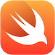

# iOS Track for Learn Apollo

[Learn Apollo](https://www.learnapollo.com/) is a tutorial website that explains how to develop applications using a GraphQL backend and the Apollo client. It's the easiest way to get started with GraphQL, guiding through practical examples using the client technology of your choice - be it **React, React Native, Angular or Vue.js**.

> Note: If you have never heard of [GraphQL](http://graphql.org/) before, it's an API design paradigm that was introduced by Facebook and eliminates many shortcomings of REST. [Apollo](http://dev.apollodata.com/) on the other hand is a _client framework_ that allows you to easily work with a GraphQL API and benefit from features like caching, subscriptions, optimistic UI, pagination and server-side rendering without the overhead of implementing these yourself!

We are now excited to launch an **iOS Track** for [Learn Apollo](https://www.learnapollo.com/). Similar to the other tracks you can find on the site, the goal is to build a fully-fledged Pokedex application that demonstrates major functionalities of the interaction with a GraphQL backend using an Apollo client - **only this time it's from within an iOS app using Swift!** 🚀 

## The Apollo iOS client

The [Apollo iOS Client](https://github.com/apollostack/apollo-ios) is currently under active development and thus lacks important features such as caching or support for GraphQL subscriptions.

Nevertheless, it already is a tremendously valuable tool when working with a GraphQL API! Its sole major feature right now, generation of the Swift types that represent the data requirements of your application, makes it incredibly easy to interact with your GraphQL server.

## How does the type generation work?

As mentioned above, the Apollo iOS client will generate Swift code for you based on your data requirements. More precisely, this means that it will read all the GraphQL _queries_ and _mutations_ that you have defined for your app and subsequently create types that reflect the data you expect to get back from the backend.

> Note: The tool that is responsible for the code generation is called `apollo-codegen` and needs to be [integrated into the build process](http://dev.apollodata.com/ios/installation.html#adding-build-step) of your Xcode project.

## Why is code generation useful?

When using the Apollo client, you're handing off responsibility for the creation of "model" types to `apollo-codegen`. Of course, you can still create your own model types and map the received data to your custom objects, but the approach that is taken in the Apollo iOS client provides lots of value:

1. No need to include _optional_ properties in model objects
2. Compile time checks for your data requirements
3. Strong flexibility and safety

Let's take a look at each of these points in more detail.

#### 1. No _optional_ properties

When working with APIs, what is usually returned to you as an app developer is JSON data. The problem with this of course is that JSON lacks strong typing, and so there are no guarantees for the developer in terms of the data they will actually receive. So, in terms of handling the JSON data, the developer is left with two options:

- Assuming they know their API _really_ well and just treat the JSON as if they knew exactly what it contained, blindly accepting the app crashing if only one single bit of data is missing in the returned JSON. This approach is very unsafe!
- Checking for every single JSON field and making sure it contains the data they expect. In Swift, this is usually done by creating _optional_ properties on the types that they are going to map the JSON data to. This is definitely the safer alternative but creates lots of overhead when actually working with the model data, since the properties need to be unwrapped every time they are used.

#### 2. Compile time checks

Compile time checks to the rescue! Since `apollo-codegen` can actually _guarantee_ that your data requirements are well reflected by your types, the two issues explained above just disappear. As recently stated by [Chris Eidhof](https://twitter.com/chriseidhof/), using `apollo-codegen`, you can now leave the ["boring stuff to the compiler"](http://chris.eidhof.nl/post/types-vs-tdd/). 

Since the types that you are working with in your code now precisely represent the data you receive from the server, you can always be sure about what the data looks like at compile time and there is no need for unwrapping optional values any more.

#### 3. Strong flexibility and safety

This approach obviously makes the app much safer as crashes that occur because of accidentally accessing a `nil` value are now simply _impossible_. Using GraphQL and Apollo, there is also a major gain in flexibility! Usually, when data requirements change, e.g. because a specific screen now needs to display different or additional information, there are two options again:

- Adjust the API and make sure th required data can be fetched with a request to the new route. This approach leads to a lot of overhead in the backend and makes rapid iterations on the application basically impossible.
- Accepting that getting the full data on the screen involves multiple API requests. This approach is obviously very inefficient - not only will it exhaust the user's network plan, most likely large parts of the data that is fetched is not even needed in the client!

With GraphQL and Apollo you get the best of both worlds! All the flexibility and efficiency from a GraphQL backend while leveraging Swift's static type system to make your app safe as ever.

